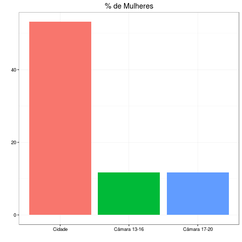
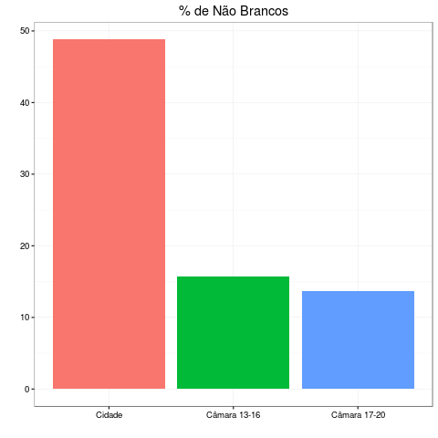

# Representatidade da Câmara de Vereadores do Rio

##Analise
####O que impede a cidade de ter uma Câmara Municipal alinhada em representatividade com os diversos grupos que formam a sociedade?

Comparamos os dados do IBGE de 2010 e a lista de vereadores no cargo em 2016 e 2017, e percebemos uma enorme disparidade entre representações relacionadas à cor da pele e ao sexo. No caso da porcentagem de pessoas brancas e pessoas do sexo masculino, apesar de representarem apenas cerca de 50% da população, assumem mais de 80% dos cargos. O quadro não melhorou nas últimas eleições.

##Metodologia

Os dados de gênero e raça são autodeclarados pelos veradores e pela população da cidade. Calculamos as porcentagens sobre o total da população e comparamos os índices.

Essa análise foi implementada em R. 

O código se encontra disponível como um notebook de ipython aqui nesse repositório.

Os dados estão disponível nesse [links](https://drive.google.com/drive/folders/0B5p2DfLvQ-6RZ3Z0azlLeTljLWc?usp=sharing).

##Fontes:

###cidade:

[IBGE / cidades / Rio de Janeiro](http://cidades.ibge.gov.br/xtras/perfil.php?codmun=330455)

###câmara:
[TSE / Divulgação de Candidaturas e Contas Eleitorais](http://divulgacandcontas.tse.jus.br)
